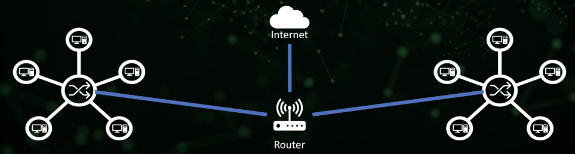

The next 7(or less) days are all about networking.\

# Networking Basics

## hosts

-   hosts are any devices that sens and receives traffic, so for example things that connect to the internet.
-   the send/receive traffic over a network

## IP address

-   the identity of each host.
-   4 octets, each being 0-255
-   hierarchically assigned

## network

-   what transports traffic between hosts
-   a logical group of hosts which require similar connectivity
-   can contain other networks (subnets)
-   can connect to other networks (internet)

## switch

facilitate communication between a network. swtiches forward data packets between hosts, and also sends data directly to hosts

-   A switch only sends data to the single device it is intended for

## router

-   facilitates communication between networks.
-   a switch is what is in ONE network, while the router lets us join MULTIPLE networks together or give them access to each other
-   provide traffic control point (sec, filtering, redirecting) more and more swithces also do this now
-   a router has an IP in the networks they are attached to. This is also going to be each host's way out of their local network, aka gateway

Routers also create the hierarchy in networks

## switches vs routers

**Routing** moves data between networks.
**switching** moves data WITHIN networks

This is very much a foundational overview of devices as we know there are many different devices such as:

-   Access points
-   firealls
-   Load balancers
-   Layer 3 switches
-   IDS/IPS
-   Proxies
-   Virtual Switches/routers

they are all going to do some sort of routing/switching

over the next few days we will do:

-   OSI Model
-   Network Protocols
-   DNS
-   NAT
-   DHCP
-   Subnets

---

# OSI model-the 7 layers

The overall purpose of networkning is to allow 2 hosts to share data. without plugging in something and walking it over.

It automates this by allowing the host to share data automatically across the wire. There are a set of rules they must follow. This is like a language

The rules have 7 layers, and it is called the OSI model

### OSI

OSI stands for Open Systems Interconnection. This is a frameowrk used to describe the functions of a networking system

This model characterises computing functions into a universal set of rules and requirements to support interoperability between different products.

### Physica

This is layer 1.

-   Physica cable, but could also consider wifi in this layer.
-   cables: ethernet, firbe, hifi, bugs
-   transporting bits: Data is in bits and something needs to transport them between hosts

### Data link

-   the data link enables a node to node transfer then data is packaged into frames. There is also a level of error correcting that might have occurred at the physical layer.
-   Interacts with cables (physical). network interface cards, wifi access cards, switches.
-   this is also where we introduce the MAC addresses
-   MAC: 48 bits, represented as 12 hex digits, every NIC has a unique MAC address

### network

-   Layer 2/3 switches are terms very often used in networking. IN layer 3 the network has a goal of an end to end delivery. This is where IP comes in
-   Routers and hosts exist in layer 3. Anything with IP can be considered layer 3
-   End to End

MAC vs IP addresses

-   MAC go from host to switch/router only, it is focues on hops whereas IP will stay with that packet of data unitl it goes to its end host
-   Layer 2 is Hop to Hop, 3 is End to End

There is also a protocol called ARP that links layer 3 and 2

### transport

This distingueshes data streams, in the same way that 2 and 3 distinguishes addressing schemes. In 4 we have oprts
basically we got protocols now

-   service to service
-   Addressing Scheme: ports.
    -   0-65535: TCP (reliability)
    -   0-65535-UDP(efficiency)
-   HTTPS: TCP/443
-   HTTP: TCP/80
-   IRC: UDP/6667

## Session, Presentation, Application

-   the distinction are kind of vague
-   when a hsot sends data to another, ti goes through whats known as the encapsulation process. That data will be first sent to layer 4
-   layer 4 will add a header to the data which is going to be a port either ECP or UDP. it also includes the source port
-   this may also be nown as a segment
-   this segment is going to be passed down the OSI stack to layer 3, the network layer, which adds another header which is the source and destination IP address.

The header + data is referred to as a packet

-   then it goes to layer 2 where it adds another header to accomplish its goal of hop to hop delivery, meaning that it adds the soruce and destination MAC address.

that frame gets converted to 1s and 0s and sent over layer 1, physical cable or wifi.

segment: dport+data
packet: ip+port+data
frame: MAC+ip+port+data
