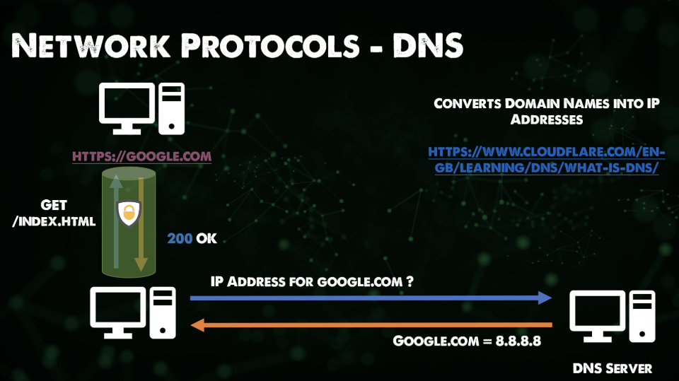
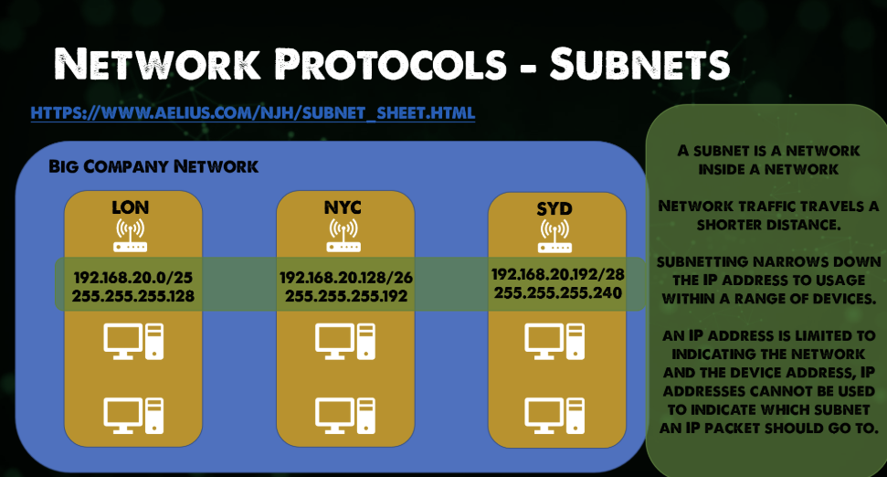

# network protocols

-   it is a set of rules and messages that forma standard.

## ARP

-   ARP is the address resolution protocol. Connects IP to fixed physical machine address. Also know as MAC addresses across layer 2\
-   so they use both ip and mac addresses

## FTP

-   file transfer protocl
-   allows file transfer from source to destination. This process is authenticated usually
-   there is the ability if configured to use anonymous access
-   now it is usually ftps which provides ssl/tls connectivity to ftp servers from the client for better security.
-   application laery of OSI

-   basically a computer talks to an FTP server, it says RETR file.md, then the server returns with file.md

so

computer 1: RETR file.md
then ftp server: sends file back

## SMTP

-   Simple Mail Transfer Protocol
-   Used for email transmission, mail servers use SMPT to send and receive mail messages.
-   250 means requested mail action okay, completed
-   user@email.com sends email, which goes to the SMTP server, then it returns with 250

## HTTP

-   hyper text transfer protocol
-   foundation of the internet, giving us the ability to easily access our websites.
-   Should use https now for security
-   200 is the success messgae:
-   user's computer makes an HTTP request (GET/POST/PUT/etc.) and the server returns it.
-   not encrypted, insecure

## SSL/TLS

-   SSL: Secure Socket Layers
-   TLS: Transport Layer Security

-   TLS has taken over from SSL, it is a cryptographic protocol that provides secure communications over a network.
-   Found in email, messaging, and other apps.
-   Most common usage is to secure HTTPS
-   creates a secure tunnel between your computer and whatever server you are using

## HTTPS

-   http secured with ssl/tls
-   Basically HTTP with a secure tunnel

## DNS

-   Maps domain names to an IP address.
-   The host requests an IP address for a domain name (like google.com) from the DNS server, then it returns the IP, then the host uses that to connect to the server for that IP over HTTPS

## DHCP

-   Dynamic Host Configuration Protocol
-   there are 4 things that we need on every host for it to be ale to access the internet or transfer file, etc.
    -   ip address
    -   subnet mask
    -   default gateway
    -   DNS
-   IP is the unique ID for our host
-   Subnet Mask will be covered shortly, but think of it as a zipcode
-   Default gateway is the IP of our router generally on our network, providing us witht that layer 3 connectivity. This is like the road that allows us on our street
-   DNS is what helps us convert public IP addresses to usable and memorable domain names

-   If you have many hosts it might be difficult or time consuming to determine each one of these individually, this is where DHCP comes in
    -DHCP allows you to determine a scope for your network and then this protocol wil ldistribute to all available hosts in your network
-   lets say you connected to a coffee shop wifi, which lets you use the internet. When you are connecteed, your machine would have picked up a DHCP address either from a dedicated DHCP server or from the router also handling DHCP

## subnetting

-   subnet is a logical division of an IP network
-   break large networks into smalle more manageable networks that run more efficiently
-   each subnet is a logical subdivision of the bigger network.
-   connected devices with subnet share common IP address identifiers, allowing them to inter-communicate
-   routers manage communication between subnets
-   subnet size depends on the connectivity requirements
-   an organization is responsible for determining the number and size of the subnets within the limits of address space available, and the details remain local to that org.
-   It can also be segmented into even smaller sub nets for things like points to point links, or subnetworks supporting a few devices
-   it also enables IP address reallocation and releves network congestion
-   subnets can improve security too
    
